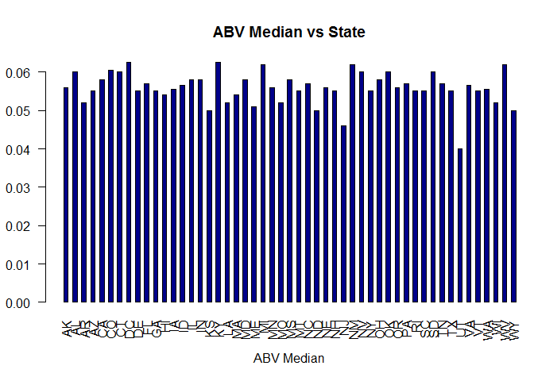
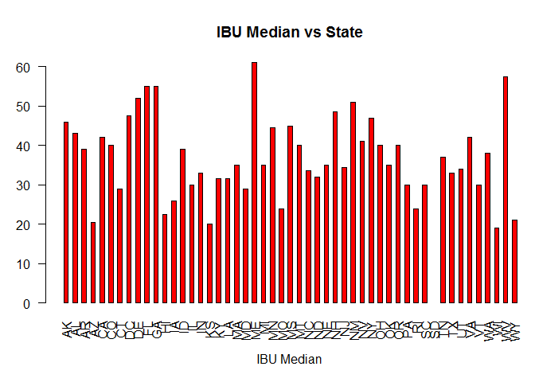
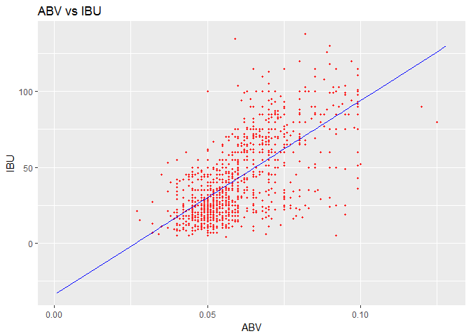

# Presentation
Steven Hayden, Thejas Prasad  
October 15, 2017  
Plots Median alcohol 

```r
setwd(getwd()) 

#runs script to clean data and merge the data the brewery logistics and beer characteristics data together.
source("C:/Users/shayden/Documents/GitHub/SMU/Doing_Data_Science_1/CaseStudy/Beer analysis project/analysis/Data/Beer_data_Cleaner.R")

#runs script to Report the number of NA's in each column.
#Compute the median alcohol content and international bitterness unit for each state.
#Finds the state with the maximum alcoholic (ABV) beer.
#Finds the state with the most bitter beer (IBU).
#analysis the relationship between ABV and IBU and stores it into the regressor varible. 
source("C:/Users/shayden/Documents/GitHub/SMU/Doing_Data_Science_1/CaseStudy/Beer analysis project/analysis/Analysis_of_beer.R")
```

```
## Warning: package 'sqldf' was built under R version 3.4.2
```

```
## Loading required package: gsubfn
```

```
## Warning: package 'gsubfn' was built under R version 3.4.2
```

```
## Loading required package: proto
```

```
## Warning: package 'proto' was built under R version 3.4.2
```

```
## Loading required package: RSQLite
```

```
## Warning: package 'RSQLite' was built under R version 3.4.1
```

```
## Warning: package 'data.table' was built under R version 3.4.2
```


```r
summary(beer_brew_merge$ABV, na.rm = TRUE)
```

```
##    Min. 1st Qu.  Median    Mean 3rd Qu.    Max.    NA's 
## 0.00100 0.05000 0.05600 0.05977 0.06700 0.12800      62
```


```r
#sets margins for graph
par(mar=c(5, 3, 4.1, 0), mgp=c(3, 1, 0), las=2)
#generates graph
barplot( ABV_IBU_Median$ABV_Median,col=c("darkblue"),space = 1,
     main="ABV Median vs State", # Title
     xlab="ABV Median" ,         # xaxis label 
     names.arg = ABV_IBU_Median$State) 
```

<!-- -->

```r
#sets margins for graph
par(mar=c(5, 3, 4.1, 0), mgp=c(3, 1, 0), las=2)
#generates graph
barplot( ABV_IBU_Median$IBU_Median,col=c("red"),space = 1,
         main="IBU Median vs State", # Title
         xlab="IBU Median",          # xaxis label 
         names.arg = ABV_IBU_Median$State)
```

<!-- -->

#Relationship between bitterness and alcohol

```r
# 7. Is there an apparent relationship between the bitterness of the beer and its alcoholic


#import data


df1 = data.frame(beer_brew_merge, na.rm = TRUE)


#ggplot
#install.packages("ggplot2",dependencies = TRUE)
library(ggplot2)
```

```
## Warning: package 'ggplot2' was built under R version 3.4.2
```

```r
ggplot() +
  geom_point(aes(x= df1$ABV, y= df1$IBU),
             colour='red', na.rm = TRUE,size = .75)+
  geom_line(aes(x= df1$ABV,y= predict(regressor, newdata = df1 )),
            colour='blue',na.rm = TRUE)+
  ggtitle('ABV vs IBU')+
  xlab('ABV')+
  ylab('IBU')
```

<!-- -->

```r
# Yes there is a linear correlation between alcholol content and the bitterness of the beer
# as the alcholol content increases and the bitterness of the beer also increases.

#----Done---
```

