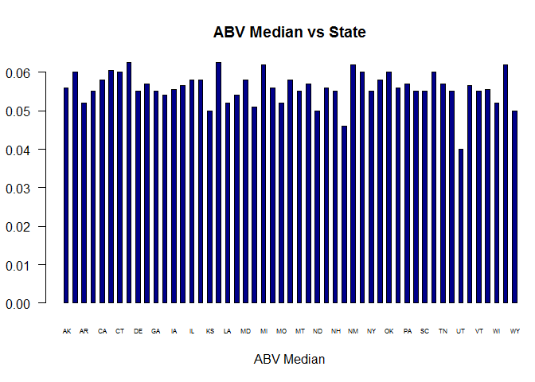
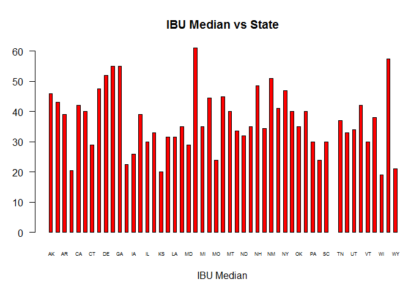
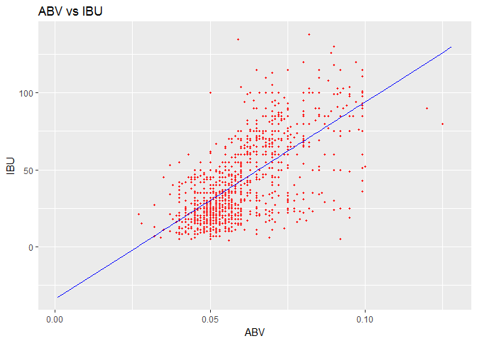

# Presentation
Steven Hayden, Thejas Prasad  
October 16, 2017  

#Introduction 

  The popularity of micro brews have exploded in the US in the past decade. There are over 5300 breweries in the US with 800 opening last year as stated in the article “U.S. Breweries Top 5,300 as Craft Beer Makers Ride Double-Digit Gains.” from NPR.  We want to know does bitterness of a beer go up as alcohol levels go up? We will use the data provide by our client and R software to conduct our analyses. 

#Gathering data

  The first R script combines the two files provide together. It does this by storing the two files as data frames and then cleaning data, so it can be joined on brewery Id. 


```r
getwd()
```

```
## [1] "C:/Users/shayden/Documents/GitHub/SMU/Doing_Data_Science_1/CaseStudy/Beer analysis project/Presentation"
```

```r
#runs script to clean data and merge the data the brewery logistics and beer characteristics data together.
#source("<......Insert the local file path.....>/Beer analysis project/analysis/Data/Beer_data_Cleaner.R")
source("C:/Users/shayden/Documents/GitHub/SMU/Doing_Data_Science_1/CaseStudy/Beer analysis project/analysis/Data/Beer_data_Cleaner.R")
```

#Data

  The data contains current characteristics of beers and their breweries across the United States. There are 558 breweries sampled and 2410 beers associated with those breweries. R is used to clean the data, put the data into a usable format, create and store function, and present the data in a readable form. Sample of data in output below. 

```r
str(beer_brew_merge)
```

```
## 'data.frame':	2410 obs. of  10 variables:
##  $ Brewery_ID  : int  1 1 1 1 1 1 2 2 2 2 ...
##  $ Beer_Name   : Factor w/ 2305 levels "#001 Golden Amber Lager",..: 802 1258 2185 1640 1926 1525 458 1218 43 71 ...
##  $ Beer_ID     : int  2692 2691 2690 2689 2688 2687 2686 2685 2684 2683 ...
##  $ ABV         : num  0.045 0.049 0.048 0.06 0.06 0.056 0.08 0.125 0.077 0.042 ...
##  $ IBU         : int  50 26 19 38 25 47 68 80 25 42 ...
##  $ Style       : Factor w/ 100 levels "","Abbey Single Ale",..: 16 77 48 83 22 57 12 46 77 18 ...
##  $ Ounces      : num  16 16 16 16 16 16 16 16 16 16 ...
##  $ Brewery_Name: Factor w/ 551 levels "10 Barrel Brewing Company",..: 355 355 355 355 355 355 12 12 12 12 ...
##  $ City        : Factor w/ 384 levels "Abingdon","Abita Springs",..: 228 228 228 228 228 228 200 200 200 200 ...
##  $ State       : Factor w/ 51 levels " AK"," AL"," AR",..: 24 24 24 24 24 24 18 18 18 18 ...
```

  The second R script is where all the analyses takes place. The median ABV and IBU by state are calculated in this scrip along with their respected max. This is where the relationship between ABV and IBU is identified as well. All these calculated objects will be later used to present the findings in a more readable way, such as graphs. 


```r
#runs script to Report the number of NA's in each column.
#Compute the median alcohol content and international bitterness unit for each state.
#Finds the state with the maximum alcoholic (ABV) beer.
#Finds the state with the most bitter beer (IBU).
#analysis the relationship between ABV and IBU and stores it into the regressor varible. 
#source("<......Insert the local file path.....>/Beer analysis project/analysis/Analysis_of_beer.R")
source("C:/Users/shayden/Documents/GitHub/SMU/Doing_Data_Science_1/CaseStudy/Beer analysis project/analysis/Analysis_of_beer.R")
```

```
## Warning: package 'sqldf' was built under R version 3.4.2
```

```
## Loading required package: gsubfn
```

```
## Warning: package 'gsubfn' was built under R version 3.4.2
```

```
## Loading required package: proto
```

```
## Warning: package 'proto' was built under R version 3.4.2
```

```
## Loading required package: RSQLite
```

```
## Warning: package 'RSQLite' was built under R version 3.4.1
```

```
## Warning: package 'data.table' was built under R version 3.4.2
```

#Data Analysis / Descriptions

  During the data analysis these are some of the key statistis observed -
The state with max alcohol content (0.128) is CO
The state which has the most bitter beer (138) is OR
The median ABV and IBU by state can be found in the data frame ABV_IBU_Median
The original data set provided had some NA's in couple of columns, there were 62 NA's in ABV couln and 1005 NA's in IBU cloumn.

#Alcohol Content Analysis

  Based on the analysis on all beer's ABV in the data set, it has been observed that the Alcohol Content in a beer falls in the range of (0.001, 0.128). The median level of Alcohol content is 0.05600. Something interesting to note here is there exists a huge variaton between the minimum and maximum levels. We had to ommit 62 NA's in this ABV column to generate the summary.


```r
#Returns the summary statistics on ABV
summary(beer_brew_merge$ABV, na.rm = TRUE)
```

```
##    Min. 1st Qu.  Median    Mean 3rd Qu.    Max.    NA's 
## 0.00100 0.05000 0.05600 0.05977 0.06700 0.12800      62
```

  The Median ABV Graph shows that there is little variation of ABV between states. This makes scene because the alcohol concentration can only go so high without distillation. If we look at the IBU Median Graph, it shows more variation. This variation could be from the competitions between breweries trying have their own unique taste.  


```r
#sets margins for graph

par(mar=c(5, 3, 4.1, 0), mgp=c(3, 1, 0), las=2)
#generates graph
barplot( ABV_IBU_Median$ABV_Median,col=c("darkblue"),space = 1,
     main="ABV Median vs State", # Title
     xlab="ABV Median" ,         # xaxis label 
     names.arg = ABV_IBU_Median$State,
     cex.names =.5,    #size of axis font
     las =1)           #Horizontal axis 
```

<!-- -->

```r
#sets margins for graph
par(mar=c(5, 3, 4.1, 0), mgp=c(3, 1, 0), las=2)
#generates graph
barplot( ABV_IBU_Median$IBU_Median,col=c("red"),space = 1,
         main="IBU Median vs State", # Title
         xlab="IBU Median",          # xaxis label 
         names.arg = ABV_IBU_Median$State,
        cex.names =.5,    #size of axis font
        las =1)           #Horizontal axis )
```

<!-- -->

##Analysis of Relationship between Bitterness vs Alcohol Content
  To analyze if there is any linear correlation between bitterness and alcohol content in the beers, we performed a Linear Regression Analysis on the data set using one of the Machine Learing techniques available in R. For this analysis we created a regressor based on the bitterness and alcohol content data provided in the dataset. Then used this regressor to predict the pattern or behaviour of the relationship between bitterness and alcohol content in the beers. It was then observed that there exits a positive linear correlation between alcholol content and the bitterness, i.e as the alcholol co ntent increases the bitterness of the beer also increases. Using all the information obtained from the regression model we have visualized the linear correlationship of Bitterness vs Alcohol Content in a graphical format.


```r
# Assign beer_brew_merge to data frame df1
df1 = data.frame(beer_brew_merge, na.rm = TRUE)

#ggplot used to generate the plots
#install.packages("ggplot2",dependencies = TRUE)
library(ggplot2)
```

```
## Warning: package 'ggplot2' was built under R version 3.4.2
```

```r
ggplot() +
  geom_point(aes(x= df1$ABV, y= df1$IBU),
             colour='red', na.rm = TRUE,size = .75)+
  geom_line(aes(x= df1$ABV,y= predict(regressor, newdata = df1 )),
            colour='blue',na.rm = TRUE)+
  ggtitle('ABV vs IBU')+
  xlab('ABV')+
  ylab('IBU')
```

<!-- -->

#Conclusion


```r
summary(regressor)
```

```
## 
## Call:
## lm(formula = IBU ~ ABV, data = df1)
## 
## Residuals:
##     Min      1Q  Median      3Q     Max 
## -78.849 -11.977  -0.721  13.997  93.458 
## 
## Coefficients:
##             Estimate Std. Error t value Pr(>|t|)    
## (Intercept)  -34.099      2.326  -14.66   <2e-16 ***
## ABV         1282.037     37.860   33.86   <2e-16 ***
## ---
## Signif. codes:  0 '***' 0.001 '**' 0.01 '*' 0.05 '.' 0.1 ' ' 1
## 
## Residual standard error: 19.26 on 1403 degrees of freedom
##   (1005 observations deleted due to missingness)
## Multiple R-squared:  0.4497,	Adjusted R-squared:  0.4493 
## F-statistic:  1147 on 1 and 1403 DF,  p-value: < 2.2e-16
```

  The relationship between ABV and IBU is a positive linear relationship. With a T Value of 33.86  and p-value of 2.2e -6.  There is strong evidence to support that there is a positive relationship. The next question to further investigate is consumer preference. Do consumers like beer that is less bitter? If so, production time may be shorted by creating a beer with less alcohol. If you have any question or concerns, please feel free to reach out to us through our Git Hub repository. 
Thank you,
Steven Hayden, Thejas Prasad

##Bibliography
Chapple, Bill. “U.S. Breweries Top 5,300 As Craft Beer Makers Ride Double-Digit Gains.” The two-Way BREAKING NEWS FROM NPR, 28 Mar. 2016, 1:06pm, www.npr.org/sections/thetwo-way/2017/03/28/521797352/u-s-breweries-top-5-300-as-craft-beer-makers-ride-double-digit-gains.
